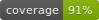

# 🔧 Errors

**Errors** 是一个用于优雅地处理 Go 中错误的库。

[Read me in English](./README.en.md)

### 🙋‍ 功能特性

* 优雅地处理 error，嗯，没了。。。

_历史版本的特性请查看 [HISTORY.md](./HISTORY.md)。未来版本的新特性和计划请查看 [FUTURE.md](./FUTURE.md)。_

### 👥 贡献者

如果您觉得 **Errors** 缺少您需要的功能，那就 fork 到自己仓库随便玩，不要提 _**issue**_，不要提 _**issue**_，不要提 _**issue**_ :)。
